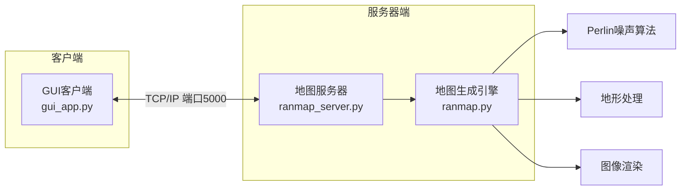

# Ranmap随机分层设色地形图生成器

[](https://www.python.org/downloads/)
[](LICENSE)
[](https://www.microsoft.com/windows)
[](https://github.com)

一个基于Python的随机地形地图生成系统，采用客户端-服务器架构，提供实时地图生成和图形化界面操作。使用Perlin噪声算法生成逼真的地形，支持实时交互和高质量图片导出。

## 简介和背景
我是一个上海地理生，热爱地理，喜欢在各种书里寻找美丽的等高设色地形图  
慢慢的，全世界的地形似乎都被我看遍了，那种观察地形的乐趣似乎在慢慢消失  
为了让我能够不丢失那一份热爱地理的初心，我创建了这样的一个随机生成地形图的项目，希望能够帮助到其他陷入"地图荒"的地理生们以及急需虚拟地图架空历史的政史学生们。  
**谨以此项目，赠与每一个向往远方的地理爱好者**  
## 功能特点

- **实时地图生成**: 使用Perlin噪声算法生成逼真的地形
- **图形化界面**: 基于PyQt5的直观用户界面，支持交互操作
- **网络通信**: 客户端-服务器架构，支持多客户端连接
- **保存功能**: 支持将生成的地图保存为PNG图片
- **加载动画**: 重新生成时显示进度提示
- **自动依赖检查**: 启动时自动检测并安装所需依赖包
- **高质量渲染**: 支持等高线显示和多层颜色渐变
- **一键启动**: Windows和Linux用户均可一键启动，无需命令行操作

## 系统要求

- **Python**: 3.6 或更高版本
- **操作系统**: Windows（已测试Windows 10/11）或 Linux（已测试Ubuntu 20.04+）
- **内存**: 至少4GB
- **显示器**: 1024x768或更高分辨率
- **Linux要求**: 需要安装X11图形环境支持PyQt5

## 快速开始

### 方法1：一键启动（推荐Windows用户）

1. 克隆或下载本项目到本地
2. 进入项目目录
3. 双击 `start.bat` 文件
4. 系统会自动完成：
   - Python环境检查
   - 依赖包验证与安装
   - 服务器启动（后台静默运行）
   - GUI界面启动

> **提示**: 服务器和GUI都会静默启动，不会显示控制台窗口，只显示图形界面。

### 方法2：一键启动（推荐Linux用户）

1. 克隆或下载本项目到本地
2. 进入项目目录
3. 给启动器添加执行权限：
   ```bash
   chmod +x start.sh
   ```
4. 运行启动器：
   ```bash
   ./start.sh
   ```
5. 系统会自动完成：
   - Python环境检查
   - 依赖包验证与安装
   - 服务器启动（后台运行）
   - GUI界面启动

> **提示**: 服务器和GUI会在后台运行，启动器窗口会显示运行状态。按Ctrl+C可停止所有程序。

### 方法3：手动安装和启动

1. **安装Python** (3.6+)
2. **安装依赖包**
   ```bash
   pip install -r requirements.txt
   ```
3. **启动服务器**
   ```bash
   python ranmap_server.py
   ```
4. **启动GUI客户端**（在新终端中）
   ```bash
   python gui_app.py
   ```

### 方法4：PowerShell启动（Windows）

```powershell
cd ran_map
.\start.bat
```

### 方法5：Bash启动（Linux）

```bash
cd ran_map
chmod +x start.sh
./start.sh
```

## 系统架构



## 工作原理

### 地图生成流程

1. **服务器初始化**
   - 在 `localhost:5000` 端口监听客户端连接
   - 初始化地图生成引擎
   - 生成并缓存初始地图

2. **客户端连接**
   - GUI客户端自动连接到服务器
   - 请求并接收初始地图数据
   - 建立持久连接用于实时通信

3. **地形生成算法**
   - 使用改进的Perlin噪声算法生成基础地形
   - 应用高斯滤波进行地形平滑
   - 根据海拔高度分配8层颜色渐变
   - 生成等高线显示地形轮廓
   - 添加海洋背景和自然地形边界

4. **实时交互**
   - 用户点击"重新生成"按钮
   - 客户端发送重新生成请求
   - 服务器生成新地图并返回数据
   - 客户端更新界面显示

### 核心技术栈

- **地图生成**: 多层Perlin噪声 + 距离函数 + 双三次插值
- **网络通信**: Python Socket TCP/IP + JSON数据传输
- **图形界面**: PyQt5 + Matplotlib
- **图像处理**: NumPy + PIL/Pillow
- **依赖管理**: pip + requirements.txt

## 界面操作

| 功能 | 操作 | 说明 |
|------|------|------|
| 重新生成 | 点击"重新生成"按钮 | 生成新的随机地形地图 |
| 保存图片 | 点击"保存"按钮 | 将当前地图保存为PNG文件 |
| 退出 | 点击"退出"按钮或关闭窗口 | 关闭程序 |

## 项目结构

```
ran_map/
├── README.md              # 项目文档
├── requirements.txt       # Python依赖包列表
├── ranmap.py             # 核心地图生成算法
├── ranmap_server.py      # 地图生成服务器（端口5000）
├── gui_app.py            # PyQt5图形界面客户端
├── start.bat             # Windows一键启动器
├── start.sh              # Linux一键启动器
└── server.log            # 服务器运行日志
└── maps/                 # 生成的地图保存目录
```

## 故障排除

### 常见问题

| 问题 | 解决方案 |
|------|----------|
| **端口冲突** (5000端口被占用) | 修改 `ranmap_server.py` 和 `gui_app.py` 中的端口号 |
| **Python路径问题** | 确保Python已添加到系统PATH环境变量，或在启动器中指定完整Python路径 |
| **依赖包安装失败** | 手动运行 `pip install -r requirements.txt`，检查网络连接 |
| **编码问题** | 使用 `start.bat` 或在命令提示符中运行而非PowerShell |
| **GUI无法启动** | 检查PyQt5是否正确安装，尝试 `pip install PyQt5` |
| **Linux GUI问题** | 确保安装了X11图形环境，检查DISPLAY环境变量 |
| **连接服务器失败** | 确保服务器已启动，检查防火墙设置 |

### 日志和调试

- **服务器日志**: 查看 `server.log` 文件
- **客户端错误**: 检查GUI界面错误提示
- **启动问题**: 观察启动器输出信息
- **网络问题**: 使用 `netstat -an | findstr :5000` (Windows) 或 `netstat -an | grep :5000` (Linux) 检查端口状态

## 性能指标

| 指标 | 数值 |
|------|------|
| 地图生成时间 | 1-10秒（取决于地图大小） |
| 内存使用 | 50-100MB |
| 最大地图尺寸 | 2048x2048像素 |
| 推荐地图尺寸 | 800x600 或 1024x768 |
| 网络端口 | 5000 (TCP) |

## 输出示例

生成的地图包含丰富的地形特征：

- **主地形**: 山脉、平原、高原、盆地、丘陵
- **8层颜色渐变**: 从深蓝（海洋）到白色（雪山）的海拔显示
- **等高线**: 清晰的地形轮廓线
- **海洋背景**: 浅蓝色海洋环境
- **自然边界**: 逼真的地形边缘形状
（示例：一些使用该程序生成的地形图）


### 开发环境设置

```bash
# 克隆项目
git clone https://github.com/evanstellun/random-map-generator.git
cd random-map-generator

# 创建虚拟环境
python -m venv venv
source venv/bin/activate  # Linux/Mac
# 或
venv\Scripts\activate     # Windows

# 安装依赖
pip install -r requirements.txt

# 启动开发服务器
python ranmap_server.py
```

## 许可证

本项目采用 MIT 许可证 - 查看 [LICENSE](LICENSE) 文件了解详情。

## 致谢

- 感谢所有贡献者和用户的支持
- 基于 Python、PyQt5 和 Matplotlib 构建
- 灵感来自程序化地形生成和Perlin噪声算法

## 联系方式

- **问题反馈**: [GitHub Issues](https://github.com/evanstellun/random-map-generator/issues)
- **功能建议**: [GitHub Discussions](https://github.com/evanstellun/random-map-generator/discussions)
- **邮件联系**: niweilun@outlook.com

---

如果这个项目对你有帮助，请考虑给个星标！

[](https://star-history.com/#evanstellun/random-map-generator&Date)

## 开发信息

- **开发语言**: Python 3.6+
- **主要依赖**: numpy, matplotlib, scipy, PyQt5
- **开发环境**: Windows 10/11, Ubuntu 20.04+
- **版本**: 1.0
- **最后更新**: 2025年8月
